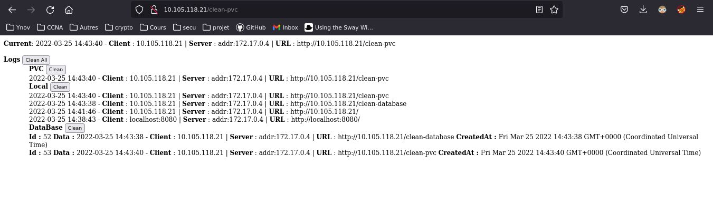

# Helm-charts-tp4

1. Cloner le repo.

2. Aller dans le dossier helm-charts-tp4/charts-tp4 puis éxecuter la commande suivante pour installer le charts :

$ helm install -f values.yaml charts-tp4 .

> Les commandes pour se connecter au service seront décrite.

